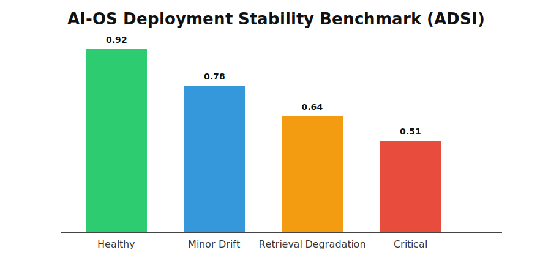

🚀 AI-OS

Production-Grade Agentic Monitoring Architecture for Enterprise AI Deployment Stability

  

  
  
  
  
  

⸻

🧠 Executive Overview

AI-OS is a production-grade agentic monitoring system that formalizes AI deployment stability into measurable, governance-aligned indices.

It transforms enterprise AI systems from opaque experimentation layers into observable, auditable, stability-scored infrastructures.

Unlike traditional dashboards, AI-OS introduces a mathematically grounded Deployment Stability Index (ADSI) integrating:
	•	Alignment integrity
	•	Infrastructure resilience
	•	Drift sensitivity
	•	Runtime guardrails
	•	Anomaly detection
	•	Autonomous monitoring

AI-OS bridges research rigor with enterprise production engineering.

⸻

🏗 System Architecture

  

Figure 1. AI-OS Enterprise Deployment Stability Monitoring Architecture integrating stability scoring, runtime guardrails, anomaly detection, service-layer orchestration, and observability endpoints.

⸻

🧱 Architecture Layer Breakdown

Layer	Responsibility	Design Principle
Stability Engine	Computes AHI, IHI, DHI, ADSI	Deterministic metric formalization
Guardrail Layer	Threshold enforcement & degradation detection	Runtime safety boundaries
Monitoring Service	Rolling history & anomaly scoring	Autonomous oversight
FastAPI Interface	Secure API exposure	Clean service boundary
Observability Endpoint	Real-time deployment health	Governance transparency
External Visualization	Decision support layer	Executive clarity

AI-OS follows strict separation of concerns aligned with enterprise deployment architecture standards.

⸻

📐 Formal Stability Model

Alignment Health Index (AHI)
AHI = 1 − Kₑ

Infrastructure Health Index (IHI)
IHI = Rₛ

Drift Health Index (DHI)
DHI = 1 − (L_d + E_s) / 2

AI Deployment Stability Index (ADSI)
ADSI = (AHI + IHI + DHI) / 3

Where:
	•	Kₑ = KPI alignment error
	•	Rₛ = Retrieval quality score
	•	L_d = Latency deviation
	•	E_s = Embedding shift

This model enables quantifiable governance over AI deployment health.

⸻

📊 Performance Benchmark

Scenario	ADSI	Stability Tier
Healthy Deployment	0.92	Stable
Minor Latency Drift	0.78	Warning
Retrieval Degradation	0.64	Degrading
Compound Drift + Latency	0.51	Critical

  

AI-OS detects compound degradation patterns earlier than isolated metric dashboards.

⸻

🛡 Core Capabilities

Stability Engine
	•	Component scoring (AHI / IHI / DHI)
	•	ADSI computation
	•	Weighted governance calibration

Runtime Guardrails
	•	Threshold enforcement
	•	Stability degradation detection
	•	Z-score anomaly scoring

Autonomous Monitoring Agent
	•	Rolling memory tracking
	•	Periodic evaluation loop
	•	Stability report generation

Observability API
	•	/health
	•	/agent/evaluate
	•	/observability

⸻

⚙️ Quick Start

git clone https://github.com/strdst7/ai-os.git
cd ai-os
python -m venv venv
source venv/bin/activate
pip install -r requirements.txt
uvicorn src.main:app --reload

Access:

http://127.0.0.1:8000/docs

⸻

🧪 Testing

pytest

Includes validation for:
	•	Stability computation
	•	Guardrail threshold triggers
	•	API integrity
	•	Monitoring service consistency

⸻

🏛 Research & Publication

AI-OS is accompanied by an IEEE-structured research manuscript formalizing:
	•	Mathematical stability modeling
	•	Calibration simulation methodology
	•	Deployment resilience framework
	•	Governance alignment architecture

Located in:

/paper

⸻

🔐 Security

See SECURITY.md for responsible disclosure guidelines.

⸻

🤝 Contributing

See CONTRIBUTING.md for development standards and architecture governance model.

⸻

📜 License

MIT License © 2026

⸻

🎯 Strategic Positioning

AI-OS is not a dashboard.
It is a deployment stability architecture.

Built for enterprise AI governance, production reliability, and research-grade operational oversight.

⸻

  
  Designed & Architected by  
  <strong>Nur Amirah Mohd Kamil</strong>  
  AI Product Systems Strategist | Enterprise AI Deployment Architecture
  

