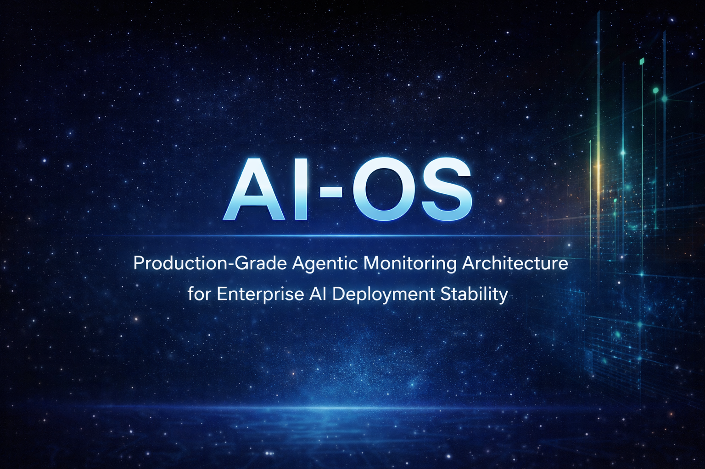
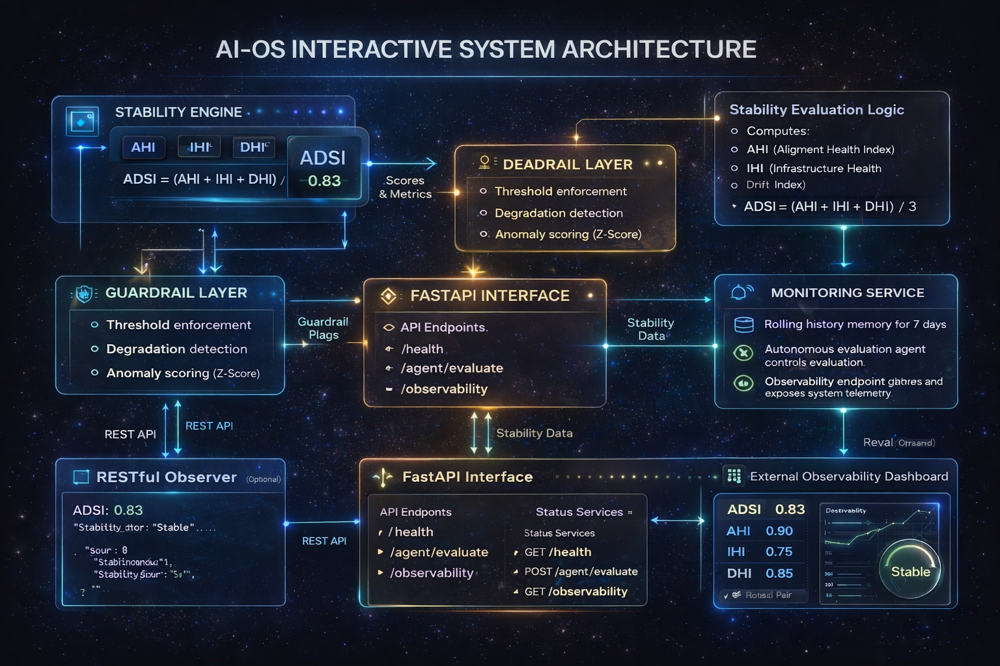

# AI-OS

### Stability-Centric Supervisory Architecture for Enterprise AI Deployments

<p align="center">


</p>
<p align="center">

</p>
<p align="center">
Production-grade monitoring architecture for detecting instability and operational drift in deployed AI systems.
</p>
Enterprise-grade monitoring framework for evaluating the operational stability of AI deployments using telemetry-driven stability metrics, guardrail monitoring, and agentic evaluation loops.
</p>

AI-OS introduces a stability-centric supervisory architecture that provides early warning signals through the AI Deployment Stability Index (ADSI), enabling proactive detection and recovery of unstable AI deployments.
---

## Why AI-OS Matters
Enterprise AI systems often degrade silently before failure due to infrastructure instability, retrieval quality drift, or latency deviations.

---

## Quick Navigation

| Section | Description |
|-------|-------------|
| [Why AI-OS Matters](#why-ai-os-matters) | Motivation behind stability-centric AI monitoring |
| [Research Contributions](#research-contributions) | Key innovations introduced by AI-OS |
| [System Architecture](#system-architecture) | Overview of the AI-OS monitoring architecture |
| [Stability Model](#stability-model) | Mathematical formulation of ADSI |
| [Monitoring Capabilities](#monitoring-capabilities) | Runtime monitoring features |
| [Deployment Failure Case Study](#deployment-failure-case-study) | Example of stability degradation detection |
| [Benchmark Comparison](#benchmark-comparison) | Comparison with existing monitoring tools |
| [Installation](#installation) | Setup instructions |
| [API Endpoints](#api-endpoints) | Available monitoring APIs |
| [Reproducibility](#reproducibility) | Dataset and reproducibility assets |
| [Future Work](#future-work) | Research directions |
---
## Contents

- Project Highlights
- Architecture
- Stability Model
- Monitoring Capabilities
- Deployment Case Study
- Installation
- API Usage
- Testing
- License
  
---

# Project Highlights

AI-OS introduces a supervisory architecture designed to monitor **AI system stability in production environments**.

Key capabilities include:

• **AI Deployment Stability Index (ADSI)** — unified stability metric  
• **Runtime Guardrails** — automatic anomaly detection  
• **Observability API** — monitoring telemetry endpoints  
• **Deployment Drift Detection** — identify system degradation  
• **Autonomous Monitoring Agents** — evaluate system health  
• **CI-tested architecture** — production-ready infrastructure

---

# Research Contributions

AI-OS introduces a new stability-centric monitoring paradigm for enterprise AI deployments.

### 1. Unified Stability Metric

AI-OS proposes the **AI Deployment Stability Index (ADSI)** — a composite metric that aggregates alignment health, infrastructure health, and drift health into a single interpretable stability score.

ADSI = (AHI + IHI + DHI) / 3


This provides a unified signal for monitoring complex AI deployments.

---

### 2. Agentic Monitoring Architecture

AI-OS integrates monitoring agents capable of evaluating deployment health and triggering guardrail responses when stability degradation is detected.

Key architectural capabilities include:

- Runtime telemetry monitoring
- Guardrail-based mitigation triggers
- Autonomous evaluation loops
- Stability trend analysis

---

### 3. Deployment-Level Observability

Unlike traditional tools that focus on infrastructure or model metrics alone, AI-OS monitors **full AI deployment pipelines**, including:

- Retrieval systems
- Latency behavior
- Embedding distribution shifts
- System response quality

---

### 4. Stability-First AI Operations

AI-OS reframes AI monitoring around **deployment stability rather than individual metrics**, enabling early detection of operational degradation in production AI systems.

---
## AI-OS Architecture



**Figure 1. AI-OS Enterprise Monitoring Architecture**

The system integrates multiple monitoring layers:

| Layer | Role |
|------|------|
Application Layer | AI agents or LLM workflows |
API Interface | FastAPI service exposing evaluation endpoints |
Stability Engine | Computes deployment stability metrics |
Guardrail Layer | Detects anomalies and enforces thresholds |
Monitoring Service | Tracks telemetry and historical stability |
Observability Dashboard | Visualizes deployment health |

---
AI-OS System Overview
                   ┌──────────────────────────────┐
                   │        AI Application        │
                   │  (LLM / Agentic Workflow)   │
                   └──────────────┬───────────────┘
                                  │
                                  ▼
                   ┌──────────────────────────────┐
                   │      FastAPI Interface       │
                   │  /health /evaluate /metrics  │
                   └──────────────┬───────────────┘
                                  │
                                  ▼
                   ┌──────────────────────────────┐
                   │        Stability Engine      │
                   │                              │
                   │  AHI – Alignment Health      │
                   │  IHI – Infrastructure Health │
                   │  DHI – Data Health           │
                   │                              │
                   │  ADSI = (AHI + IHI + DHI)/3  │
                   └──────────────┬───────────────┘
                                  │
                    Stability Metrics & Scores
                                  │
                                  ▼
                   ┌──────────────────────────────┐
                   │        Guardrail Layer       │
                   │                              │
                   │  • Threshold enforcement     │
                   │  • Drift detection           │
                   │  • Anomaly scoring (Z-score) │
                   └──────────────┬───────────────┘
                                  │
                         Alert / Recovery
                                  │
                                  ▼
                   ┌──────────────────────────────┐
                   │      Monitoring Service      │
                   │                              │
                   │  • Rolling telemetry memory  │
                   │  • Autonomous evaluation     │
                   │  • Stability reporting       │
                   └──────────────┬───────────────┘
                                  │
                                  ▼
                   ┌──────────────────────────────┐
                   │  External Observability UI   │
                   │                              │
                   │   ADSI Dashboard & Alerts    │
                   └──────────────────────────────┘

## Core Stability Model

AI-OS defines the **AI Deployment Stability Index (ADSI)**:

AHI = 1 − Kₑ
IHI = Rₛ
DHI = 1 − (L_d + E_s)/2

ADSI = (AHI + IHI + DHI) / 3

Where:

| Variable | Meaning |
|--------|--------|
Kₑ | KPI alignment error |
Rₛ | Retrieval quality |
L_d | Latency deviation |
E_s | Embedding drift |

The ADSI score provides a unified signal of AI deployment health.

---

## Monitoring Capabilities

AI-OS enables:

• Runtime stability scoring  
• Telemetry-driven anomaly detection  
• Deployment drift monitoring  
• Guardrail-based mitigation triggers  
• Observability dashboards for production AI systems  
Example monitoring output:

```json
{
  "ADSI": 0.83,
  "AHI": 0.90,
  "IHI": 0.75,
  "DHI": 0.85,
  "status": "Stable"
}
```
Failure Detection Timeline

ADSI
1.0 ┤ ███████████████ Stable
0.8 ┤ ██████████ Warning
0.6 ┤ █████ Degradation
0.4 ┤ █ Critical
      └────────────────────────
       T0   T20   T40   T60   T80
---
 ---

## AI Deployment Stability Lifecycle

AI-OS continuously evaluates deployment stability through a closed monitoring loop.

The system detects degradation signals early and activates guardrails to maintain system health.

```mermaid
flowchart LR

A[Stable AI Deployment] --> B[Telemetry Monitoring]

B --> C[Stability Evaluation]

C --> D{ADSI Score Healthy?}

D -- Yes --> A

D -- No --> E[Guardrail Trigger]

E --> F[Agent Evaluation]

F --> G[Mitigation Action]

G --> H[System Recovery]

H --> A

---

## Deployment Failure Case Study

Enterprise AI deployments rarely fail instantly.  
Instead, degradation occurs gradually through latency drift, retrieval quality degradation, or infrastructure instability.

AI-OS detects these instability signals early through the **ADSI stability score**.

**Failure → Early Detection → Recovery**

---

**Failure Progression Example**

Stable Deployment

↓

Embedding Drift Detected

↓

Latency Degradation

↓

ADSI Score Drop

↓

Guardrail Trigger

↓

Monitoring Agent Evaluation

↓

Mitigation Action

↓

System Recovery

---

**Example Telemetry Timeline**

T0   Stable system              ADSI = 0.92
T20  Latency deviation detected ADSI = 0.86
T40  Embedding drift observed   ADSI = 0.79
T60  Guardrail triggered        ADSI = 0.72
T80  Recovery initiated         ADSI = 0.84
T100 System stabilized          ADSI = 0.90

---
**Benchmark Comparison**

System	Monitoring Scope	Drift Detection	Stability Metric	Infrastructure Monitoring
Prometheus	Infrastructure	No	No	Yes
Evidently AI	Data Drift	Yes	No	No
AI Model Monitoring	Model Metrics	Yes	No	No
AI-OS	End-to-End AI Deployment	Yes	ADSI	Yes

AI-OS uniquely introduces deployment-level stability monitoring.

---
**Installation**

**Clone the Repository**

git clone https://github.com/strdst7/ai-os.git
cd ai-os

**Create Virtual Environment**

python -m venv venv
source venv/bin/activate

**Install Dependencies**

pip install -r requirements.txt

**Run the Server**

uvicorn src.main:app --reload

---

**Prerequisites**

º Python 3.10+

º FastAPI

º Uvicorn

º NumPy

º Pandas

º Matplotlib

º Pytest

---
**API Endpoints**

Endpoint	         Description
/health	System health check
/agent/evaluate	Evaluate deployment stability
/observability	Telemetry monitoring data

---
**Reproducibility**

Example telemetry dataset:

data/sample_telemetry.json

Reproducibility notebook:

notebooks/reproducibility_analysis.ipynb

---

**Supplementary Materials**

Supplementary materials include:
• Benchmark charts
• Stability timeline visualizations
• Reproducibility notebooks
• Sample telemetry dataset

---
## Future Work

Future development of AI-OS will focus on:

- Multi-agent orchestration for adaptive monitoring
- Self-healing deployment pipelines
- Reinforcement-learning-driven guardrails
- Cross-deployment stability benchmarking
---

**License**

MIT License
---

**Author**

**Nur Amirah Mohd Kamil**

---
**Citation**

If you use AI-OS in research, please cite:

AI-OS: Stability-Centric Supervisory Architecture for Enterprise AI Deployments

Nur Amirah Mohd Kamil

2026
